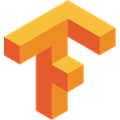

# TensorFlow Snippets



This extension includes a set of useful code snippets for developing TensorFlow models.

## Getting started

Create a new directory for your project.
Create trainer.py, open the file and type: `tf:trainer` enter.
Create cnn.py, open the file and type: `tf:cnn-classifier` enter.
Create mnist.py, open the file and type: `tf:mnist` enter.

Edit trainer.py, and insert two lines in the top:
```python
import cnn
import mnist
```

In the MODELS dictionary, add a new element `"cnn": cnn`, also in the DATASETS dictionary add a new element `"mnist": mnist`. Now run the trainer:
```
python -m trainer --model=cnn --dataset=mnist
```

Open another terminal window in the same directory, and type:
```
tensorboard --logdir=output
```

Point your browser at http://localhost:6006.


## Features

The extension includes two sets of snippets. The first are used to generate a framework for training neural networks:

- `tf:trainer`: Generates an entire training framework based on learn API.
- `tf:cnn-classifier`: Generates a convolutional neural network classifier.
- `tf:mnist`: Generates data loader for mnist dataset.

The second set of commands are short code snippets for common TensorFlow operations:
- `tf:import`: Imports TensorFlow package.
- `tf:conv2d`: Defines a 2D convolution layer.
- `tf:dense`: Defines a dense (fully connected) layer.
- `tf:maxpool2d`: Defines a max pooling layer.
- `tf:dropout`: Defines a dropout layer.
- `tf:cross-entropy`: Defines a softmax cross entropy loss.

## Requirements

```
pip install numpy
pip install tensorflow
pip install six
```

## Release Notes

Users appreciate release notes as you update your extension.

### 0.0.2
Initial release.
